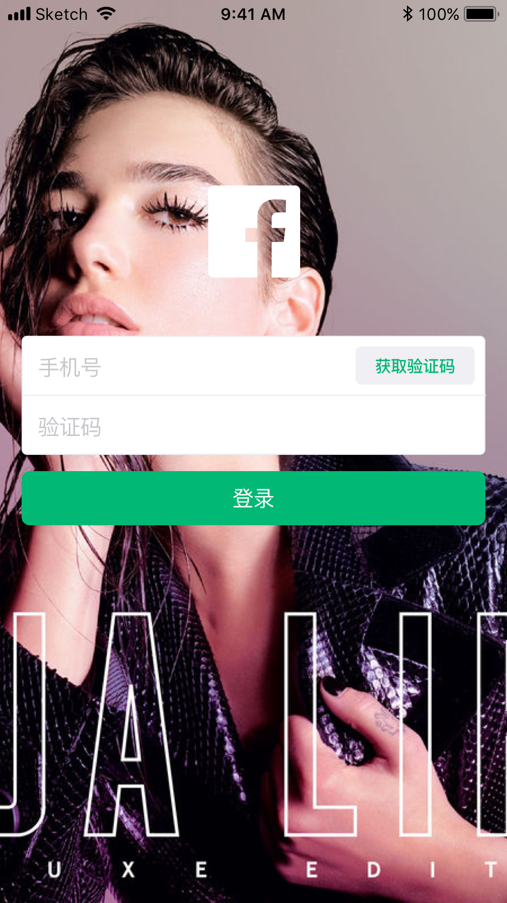

#### 本项目是我个人的 iOS、Android 学习历程

### 面向对象

掌握基本的 Web 开发技术「HTML、CSS、JS、ReactJS」及基本的 Swift、Java 语法

### 目标

理解基本的 iOS、Android 开发套路，包括各平台开发基本理念，相关开发框架、相关工具类库

开发一个简单的类微博 iOS App 的登录与首页 UI Demo，包含 UI 布局、约束布局、网络请求、本地缓存、性能监控、包管理等

迁移与融合，与 React Native 部分功能相融合，解决性能问题

### 最终 demo

### 指南及参考

[Swift 5.1 官方教程](https://docs.swift.org/swift-book/GuidedTour/GuidedTour.html)

[Swift 4从零到精通iOS开发](https://www.amazon.cn/dp/B07SYY4K9B)

[iOS 初学者教程](https://www.appcoda.com/learnswift)

[Android 第一行代码](https://www.amazon.cn/dp/B072FCNT11/)

[Android 官方文档](https://developer.android.com/)
